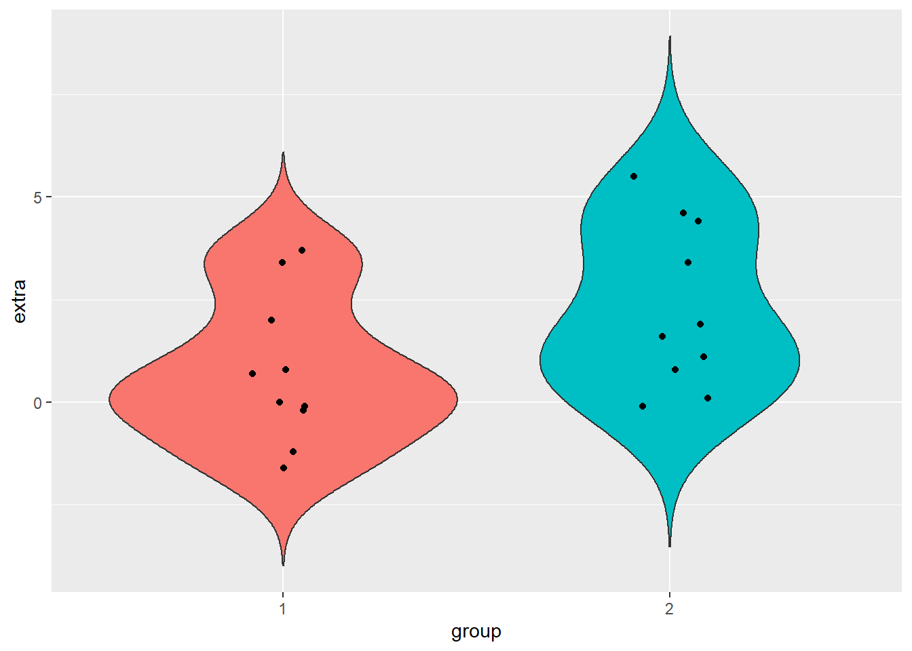

## JASPDATA

* Wagenmakers, E.-J., Kucharský, Š., & the JASP Team. (2020). The JASP Data Library (1st ed.). https://doi.org/10.6084/m9.figshare.9980744
[A könyv elérése](https://jasp-stats.org/wp-content/uploads/2020/05/The_JASP_Data_Library_1st_Edition.pdf)


### `Sleep` adatbázis

#### Description:

This famous data set, "Sleep", provides the number of additional hours that ten patients slept after having been administered two `soporific drugs' (i.e., sleeping pills). The data set was used both by Student and by Fisher in seminal articles. 

#### Variables:

* `extra` - Increase of sleep (in hours) relative to a control drug.
* `group` - Type of a soporific drug. Note that the data are in long format - each patient has been administered both soporific drugs and a control drug.
* `ID` - Participants' identification number.

This example JASP file demonstrates the use of descriptive statistics.

#### Reference:

Cushny, A. R and Peebles, A. R. (1905). The action of optical isomers. The Journal of Physiology, 32: 501-510.


```r
# beolvasás
sleep <- read.table(file = "adat/jaspdata/sleep.csv", 
                    sep = ",", 
                    dec = ".",
                    header = T, 
                    quote = "",  
                    comment.char = "", 
                    fileEncoding = "UTF-8"
                    )
# típuskonverzió
sleep$group <- factor(sleep$group)
sleep$ID <- factor(sleep$ID)
str(sleep)
#> 'data.frame':	20 obs. of  3 variables:
#>  $ extra: num  0.7 -1.6 -0.2 -1.2 -0.1 3.4 3.7 0.8 0 2 ...
#>  $ group: Factor w/ 2 levels "1","2": 1 1 1 1 1 1 1 1 1 1 ...
#>  $ ID   : Factor w/ 10 levels "1","2","3","4",..: 1 2 3 4 5 6 7 8 9 10 ...

# leíró statisztikai mutatók
library(DescTools)
Desc(formula = extra~group, data = sleep, plotit = F)
#> ---------------------------------------------------------- 
#> extra ~ group (sleep)
#> 
#> Summary: 
#> n pairs: 20, valid: 20 (100.0%), missings: 0 (0.0%), groups: 2
#> 
#>                         
#>               1        2
#> mean      0.750    2.330
#> median    0.350    1.750
#> sd        1.789    2.002
#> IQR       1.875    3.275
#> n            10       10
#> np      50.000%  50.000%
#> NAs           0        0
#> 0s            1        0
#> 
#> Kruskal-Wallis rank sum test:
#>   Kruskal-Wallis chi-squared = 3.4378, df = 1, p-value = 0.06372

# ábra
library(ggplot2)
ggplot(data = sleep, mapping = aes(x=group, y=extra, fill=group)) + 
  geom_violin(trim = FALSE) + 
  geom_jitter(height = 0, width = 0.1) + 
  theme(legend.position = "none") 
```



